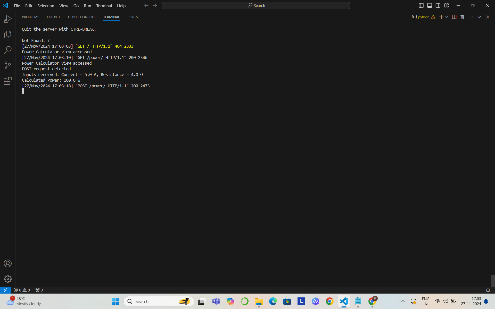

# Ex.05 Design a Website for Server Side Processing
## Date: 27-11-2024

## AIM:
 To design a website to calculate the power of a lamp filament in an incandescent bulb in the server side. 


## FORMULA:
P = I<sup>2</sup>R
<br> P --> Power (in watts)
<br> I --> Intensity
<br> R --> Resistance

## DESIGN STEPS:

### Step 1:
Clone the repository from GitHub.

### Step 2:
Create Django Admin project.

### Step 3:
Create a New App under the Django Admin project.

### Step 4:
Create python programs for views and urls to perform server side processing.

### Step 5:
Create a HTML file to implement form based input and output.

### Step 6:
Publish the website in the given URL.

## PROGRAM :

```
<!DOCTYPE html>
<html lang="en">
<head>
    <meta charset="UTF-8">
    <meta name="viewport" content="width=device-width, initial-scale=1.0">
    <title>Power Calculator</title>
    <style>
        body {
            font-family: Arial, sans-serif;
            background-color: #fc05f4;
            margin: 0;
            padding: 0;
            display: flex;
            justify-content: center;
            align-items: center;
            height: 100vh;
        }
        .container {
            background-color: #bbff02;
            padding: 20px;
            border-radius: 8px;
            box-shadow: 0 4px 8px rgba(0, 0, 0, 0.1);
            width: 300px;
            text-align: center;
        }
        h1 {
            font-size: 20px;
            color: #333333;
        }
        label {
            display: block;
            margin: 10px 0 5px;
            font-weight: bold;
        }
        input {
            width: calc(100% - 20px);
            padding: 8px 10px;
            margin-bottom: 15px;
            border: 1px solid #cccccc;
            border-radius: 4px;
        }
        button {
            width: 100%;
            padding: 10px;
            background-color: #007bff;
            color: white;
            border: none;
            border-radius: 4px;
            cursor: pointer;
            font-size: 16px;
        }
        button:hover {
            background-color: #0056b3;
        }
        .result {
            margin-top: 15px;
            font-size: 18px;
            font-weight: bold;
            color: #fb0303;
        }
        .error {
            color: #dc3545;
        }
    </style>
</head>

<body>
    <div class="container">
        <h3><b>PRABU KARTHIEK  (24010663)</b></h3>
        <h1>Calculate Power (P = I²R)</h1>
        <form method="post">
            
            <label for="current">Current (I): </label>
            <input type="number" step="any" id="current" name="current" required>

            <label for="resistance">Resistance (R): </label>
            <input type="number" step="any" id="resistance" name="resistance" required>

            <button type="submit">Calculate</button>
        </form>
        
        <div class="result">
            <h2>Result:</h2>
            <p>power: {{power}}</p>
            
        </div>
        
    </div>
</body>
</html>

```


## SERVER SIDE PROCESSING:



## HOMEPAGE:


## RESULT:
The program for performing server side processing is completed successfully.
